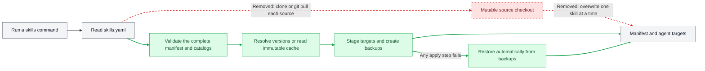

# Repository-Versioned Skill Management

Status: Draft

Author / Reviewers: `git-hulk` / `git-hulk`

Design target: [`github.com/git-hulk/clime`](https://github.com/git-hulk/clime)

References:

- [Go Modules Reference](https://go.dev/ref/mod)
- [Managing dependencies in Go](https://go.dev/doc/modules/managing-dependencies)
- [Current clime skill catalog implementation](https://github.com/git-hulk/clime/blob/master/internal/skill/github.go)

## Summary

clime will use `~/.clime/skills.yaml` to declare Git repositories, locked versions, and selected skills, then reconcile that desired state into `~/.claude/skills` and `~/.codex/skills`. The first version will access public and private repositories through Git, lock each source to a tag or full commit SHA, cache immutable snapshots locally, and automatically restore backups if any apply step fails.

## Motivation

The current manifest records each installed skill's `source`, `path`, and installation time, but it does not record the repository version. Later operations run `git pull`, so the same manifest may install different content at different times. Repository-level versioning is needed to make installation, updates, offline recovery, and private-repository access predictable without depending on GitHub REST API rate limits.

## Detailed Design

### 1. Manifest contract

`~/.clime/skills.yaml` is the only desired-state manifest. A canonical `host/owner/repo` is the top-level key; there is no `schema` field or `repositories` wrapper:

```yaml
# Reviewed by the platform team.
github.com/acme/agent-skills:
  version: v1.4.2
  skills:
    - rest-api-design
    - write-technical-design

github.company.com/platform/private-skills:
  version: 8f9f4e0b67b9f6c627e93ab4e56ee48d623aa095
  skills:
    - internal-review
```

`version` contains either a resolved tag or a full commit SHA. Commands may accept `latest`, a branch, or a short commit as input, but clime will not persist floating or ambiguous values:

- `latest` resolves to the highest stable SemVer tag.
- If a repository has no SemVer tags, `latest` resolves to the default branch's full commit SHA.
- A branch or short commit resolves to a full commit SHA.
- A prerelease is selected only when the user requests it explicitly.

clime treats tags as immutable release identifiers supplied by the repository owner. Users who require strict cross-machine reproducibility must use a full commit SHA. The first version will not add a checksum or separate lock field.

CLI mutations will edit YAML nodes rather than marshal the whole manifest from structs. This preserves user comments and keeps untouched repository entries stable. New repository keys and skill names will use deterministic ordering so an update does not create unrelated diff noise.

Every install, update, sync, uninstall, and purge operation will validate the complete manifest before contacting a remote or mutating the filesystem:

- Top-level keys must be unique, valid canonical repositories. An `owner/repo` input normalizes to `github.com/owner/repo`.
- `version` and `skills` must be non-empty, and a repository cannot list the same skill twice.
- Two repositories cannot select the same skill name because both agent targets install into `<skills-root>/<skill-name>`.
- Every selected skill must exist in the catalog at the locked version, resolve to a path contained by the repository root, and contain `SKILL.md`.

Validation failure aborts the entire operation before any download, installation, deletion, or manifest rewrite. clime will not resolve a collision or remove a missing skill automatically because either action would change user-owned desired state.

### 2. Repository catalog

At the locked snapshot, clime will retain the existing catalog precedence: root `skills.yaml` or `skills.yml`, then `.claude-plugin/marketplace.json`, then `.claude-plugin/plugin.json`. This keeps compatibility with current clime behavior without requiring repositories to publish a new clime-specific file.

The catalog maps a selected skill name to a relative path within the snapshot. The consumer manifest will not persist `path` or `description`; both are derived from a particular repository version, and persisting them would create a second source of truth that may disagree with the catalog.

### 3. Version resolution and private access

clime will query refs and fetch snapshots through Git transport instead of the GitHub Releases, Tags, or Commits REST APIs. `git ls-remote --symref` exposes the default branch and refs, and a shallow fetch retrieves only the selected revision. The same implementation therefore supports GitHub, GitHub Enterprise, and other compatible Git hosts.

Private repositories will use authentication already configured for Git: an SSH agent, `~/.ssh/config`, a Git credential helper, `.netrc`, Git `insteadOf` rules, or credentials configured through `gh auth setup-git`. clime will not read `gh auth token`, accept or store tokens, or include credentials in the manifest, process arguments, or error output. HTTPS and SSH inputs normalize to the same repository identity while the local Git configuration chooses the transport.

The first version will not introduce a remote proxy. Each machine contacts the Git host the first time it reads an uncached version and uses the local cache thereafter. This removes dependency on GitHub REST API quotas, although a Git host may still throttle unusually dense Git transport traffic.

### 4. Flow changes



Gray nodes and edges are unchanged, green paths are added, and red dashed paths are removed. The new flow proves that the entire desired state can be resolved and installed before changing either agent target. The removed flow updates a mutable checkout and saves state after installing individual skills.

### 5. Cache and purge

Snapshot caches will live under `~/.clime/cache`, addressed by canonical repository and a filesystem-safe version. clime will fetch, check out, and validate a snapshot in a temporary directory, then commit it to the cache with a rename. A committed cache entry is immutable: clime will never run `git pull` or edit it in place. Internal cache metadata may record the resolved commit and source details, but this metadata will not be added to `skills.yaml`.

`sync` will not access the network when every referenced snapshot is cached, allowing a cached private repository to recover while credentials or the network are temporarily unavailable. Multiple versions of one repository may coexist, so changing the manifest back to an older version can reconcile directly from cache.

`clime skills purge` will validate the complete manifest and delete every cache entry that the manifest does not reference. It will not remove referenced snapshots, installed skills, or transaction-recovery backups. The first version will not evict entries automatically by age or size because that could remove a version needed for rollback.

### 6. Transaction and recovery

Each command is one transaction. A no-argument update across all repositories is not split into independently committed source updates. During preflight, clime resolves every repository, reads every catalog, checks all collisions, and prepares all selected skill content. Only after preflight succeeds will it create staging directories and backups beside each agent target and begin replacing target directories.

If a target replacement, deletion, or manifest save fails, clime will automatically restore every changed target from backup. A CLI-generated manifest change will be saved through a temporary file and rename only after target application succeeds, and backups will remain available until that manifest rename completes. After a successful restoration, clime removes staging data and backups and returns the original error. If restoration itself fails, clime reports a partial-state error with the retained backup paths for manual recovery.

When a user edits the manifest manually before running `sync`, clime will restore only the agent targets on failure; it will not rewrite the user-edited manifest. The edit happened outside the transaction, so clime cannot infer which previous text the user intends to restore.

If an updated catalog no longer contains any selected skill, the operation fails during preflight. The old version, manifest, and targets stay unchanged. clime will not remove the missing skill automatically.

### 7. CLI changes

- `clime skills install <repo>[@<version>]` reads the target catalog and opens an interactive multi-select. Omitting the version means `latest`. Confirmation updates the manifest and reconciles it.
- `clime skills update [<repo>[@<version>]]` updates one source when a repository is specified and updates every source to `latest` when no argument is given. An explicit branch or commit follows that query. Both forms preserve the selected skills.
- `clime skills uninstall [<skill>]` removes the selection from its repository. Removing the final skill also removes the repository entry, after which clime reconciles the manifest.
- `clime skills sync` applies only the versions already locked in the manifest. It does not select a new version or perform an implicit update.
- `clime skills purge` removes cache entries not referenced by the manifest.
- `clime skills list` shows repositories, locked versions, selected skills, and target state without network access.

The `repo@version` parser recognizes a version suffix after the repository path. In `git@github.com:acme/agent-skills.git@v1.4.2`, it does not treat the first `@`, which belongs to the SSH user, as the version separator. CLI output and errors use a credential-free canonical repository rather than the original transport URL.

The first version will not support local directories. `clime skills install /local/path` returns an explicit unsupported-source error and does not write `version: local`; mutable working-directory content has no immutable identity, so such a value would falsely imply reproducibility.

### 8. Data migration

On first read, clime will recognize the legacy top-level `skills` and `sources` fields. The migrator groups old skills by canonical remote repository and reads the current `HEAD` from the corresponding `~/.clime/sources/<repo>` checkout. It stores that full commit SHA as the new `version`. Migration will not run `git pull` because the remote's current HEAD cannot prove which content was installed locally.

Before replacement, clime saves the original file as `skills.yaml.bak`. It replaces the old file by rename only after validating the migrated manifest, cached content, catalogs, and conflicts. If any legacy entry is a local directory, its cache is missing, its HEAD cannot be resolved, or migration creates a name conflict, migration aborts as a whole. The legacy manifest and agent targets remain unchanged, and the error directs the user to move local content to a Git repository or resolve the reported conflict.

Migration will not delete the legacy mutable cache. A successful migration creates a new immutable cache entry for the detected commit; a later `clime skills purge` can remove unreferenced legacy cache data.

### 9. Compatibility and rollback

| Surface | Impact and mitigation |
| --- | --- |
| Legacy `skills.yaml` | The first read migrates it automatically and creates `skills.yaml.bak` before replacement. A failed migration continues to use the old file. |
| Previous clime binary | Previous versions cannot parse the repository-keyed manifest. Rolling back the binary requires restoring `skills.yaml.bak` in the same operation. |
| Local-directory installation | The new version rejects this input. Users who still need it must remain on the previous clime version until they publish the skill in Git. |
| Installed agent targets | The first reconcile replaces complete directories through staging and backup, removing files deleted upstream. Failure restores the original directories. |
| Tag versions | Existing machines continue using their immutable local cache; a new machine trusts the tag's current upstream target. Use a full commit SHA when cross-machine identity must be strict. |

Migration alone does not modify installed skill content, so release rollback can restore the previous binary and `skills.yaml.bak`. After the user performs an install or update with the new version, the legacy backup no longer represents current desired state. In that case, rollback means selecting the previous repository version in the new manifest and running `sync`, not letting an old binary overwrite the new state.

### 10. Test plan

| Risk | Level | Falsifiable assertion |
| --- | --- | --- |
| YAML mutations destroy comments | Unit | After install, update, and uninstall round trips on a manifest with document, repository, and skill comments, comments on untouched nodes and their relative order remain unchanged. |
| Repository or skill conflicts cause partial writes | Unit + integration | Given duplicate repository keys, duplicate skills, or a cross-source name collision, the command reports every conflict, never invokes the Git runner, and leaves the manifest, cache, and both agent targets byte-for-byte unchanged. |
| `latest` selects the wrong version | Integration | Given a temporary Git repository with stable, prerelease, and non-SemVer tags, `latest` selects the highest stable SemVer; without a SemVer tag, it stores the default branch's full HEAD SHA. |
| A branch or short commit remains floating or ambiguous | Integration | After install receives a branch or short commit, the persisted `version` equals the full commit SHA resolved at that time. |
| The SSH `@` is parsed as a version separator | Unit | `git@host:owner/repo.git@v1.2.3` resolves to the SSH repository plus `v1.2.3`, while an SSH URL without a version produces no false version suffix. |
| Private credentials leak | Unit + integration | Given a remote and Git error containing HTTPS userinfo or a token, the manifest, stdout, stderr, and returned error contain no credential while the Git runner still uses system credential configuration. |
| Cached sync still requires the network | Integration | After caching a private snapshot, disable the Git runner and run `sync`; both agent targets restore successfully from cache. |
| Purge deletes a referenced version | Integration | Given referenced and unreferenced versions in cache, `purge` deletes only unreferenced entries. |
| An update silently removes a selected skill | Integration | When the new catalog lacks one selected skill, update fails and keeps the old manifest, cache reference, and targets. |
| Multi-target apply leaves partial state | Integration | Inject failure during the second target replacement and during manifest rename; every changed target restores from backup and the manifest retains its original content. |
| Backup restoration failure is hidden | Integration | Inject both apply and restore failures; the returned error marks partial state and includes paths to backups that still exist. |
| Legacy state is migrated incorrectly | Integration | Remote legacy entries merge using cached HEAD; a local entry, missing cache, or post-migration name collision aborts migration and leaves the legacy manifest and targets unchanged. |
| Directory replacement leaves stale files | Integration | A file present only in the old version is absent after update and every new file exists; an injected failure restores the complete old directory. |

### 11. Release verification

Before release, run the candidate binary in an isolated HOME through end-to-end scenarios for a public repository, an authorized private repository, legacy migration, offline sync, and injected rollback. Any manifest/target inconsistency, credential disclosure, or backup-restoration failure stops the release and rejects the candidate binary. clime is a local CLI, so the first version will not add remote telemetry; diagnostics consist of the command phase, canonical repository, version, and sanitized failure reason.

## Drawbacks

- A tag-only manifest cannot detect a moved tag across machines. Strict reproducibility requires a full commit SHA.
- Without a remote proxy, every new machine must contact the Git host for uncached versions and may still encounter Git transport throttling at larger scale.
- Transactions retain staging content and backups for every affected target, requiring temporary disk space close to the combined old and new skill content.
- The global manifest and global agent targets cannot select different skill sets per project.
- Removing local-directory installation means skill authors must commit content to a Git repository before exercising the complete installation flow.
- Previous binaries cannot read the new manifest, so binary rollback also requires restoring the legacy manifest backup.

## Alternatives

- **Add a `repositories` wrapper or `schema` field.** A top-level repository mapping already guarantees one entry per source, and fixed legacy keys distinguish the old format. Extra nesting does not improve first-version behavior.
- **Store both a tag and resolved commit.** This detects moved tags, but adds a manifest field that was explicitly rejected. Users requiring strict identity can store the full commit SHA in `version`.
- **Persist `latest` or a branch.** Every sync could install different content, violating locked desired state. clime resolves these inputs before writing.
- **Build a remote proxy in the first version.** A proxy reduces duplicate downloads but introduces deployment, authentication, private-path isolation, and operational ownership. Local cache plus Git transport already avoids GitHub REST API quotas.
- **Keep mutable shallow clones and run `git pull`.** A cache tied to current branch state cannot retain multiple immutable versions or guarantee offline rollback.
- **Automatically namespace duplicate skill names by repository.** This changes the skill names agents discover and may break existing prompts. The first version requires the user to resolve the collision before apply.
- **Keep local directories with `version: local`.** Mutable local content has no immutable identity, so the manifest would claim reproducibility it cannot provide.

## Unresolved Questions

None.
